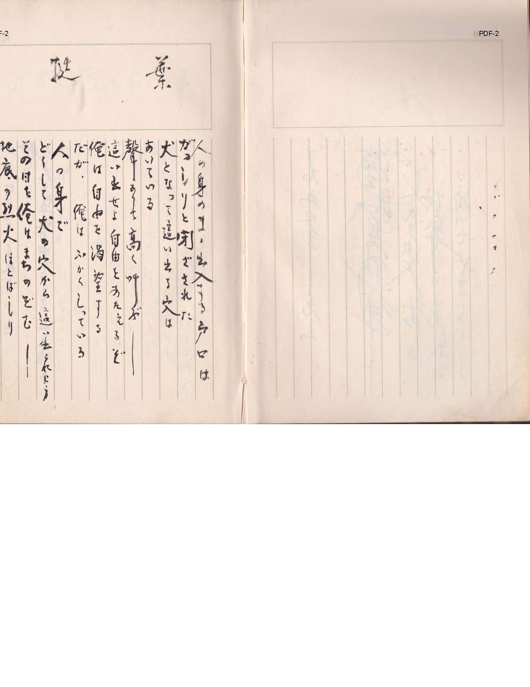

# Task: Diary Entry

**Category:** Image and Language Parsing

## Description

Ask the agent to read and translate a handwritten diary entry.

## Prompt

> What does this say?

**Input image:** 

## Results

| Agent | Score | Notes |
|---|---|---|
| ChatGPT 5.5 Pro Extended | pass, with caveats | Initial title wrong, corrected when pushed; 18 min initial response, 8 min correction |

## Responses

### ChatGPT 5.5 Pro Extended — *pass, with caveats*

**Performance notes:**
- Initial response took 18 minutes
- Correction after push took 8 minutes
- Likely consumed significant tokens

**Initial response:**

Correctly identified the language as Japanese written vertically. However, initially misread the title as 「投棄」("Discarding/Abandonment"). The main body text was parsed accurately:

> **Abandonment**
> The doorway through which one could come and go while still in human form was firmly shut.
> The hole through which one could crawl out as a dog was open.
> A voice—rough and shrill—shouted:
> "Crawl out. I'll give you freedom."
> I long for freedom.
> But I know deeply:
> how could I, in a human body, crawl out through a dog's hole?
> I await that day—
> when the raging fire beneath the earth bursts forth…

**After being pushed on the title:**

When challenged on the title reading, correctly identified it as 葉挺 (Ye Ting/Yō Tei), a Chinese name, and recognized the text as a Japanese rendering of 葉挺's「囚歌」(Prison Song). Provided detailed character-by-character analysis explaining the cursive/abbreviated forms that led to the initial misreading.

**Assessment:**
- ✅ Language identification: Correct (Japanese, vertical)
- ✅ Character recognition: Very accurate for handwritten text
- ✅ Translation: Accurate and natural
- ✅ Text orientation: Correctly parsed vertical right-to-left
- ⚠️ Title: Initially wrong but self-corrected when challenged
- ✅ Completeness: Full text translated
- ⚠️ Performance: Extremely slow (26 minutes total)

Overall a strong pass with impressive handwriting recognition, though the title error and processing time are notable caveats.

## Evaluation Criteria

- **Language identification**: Can the agent correctly identify the language and writing system?
- **Character recognition**: Can the agent accurately read the handwritten characters?
- **Translation accuracy**: Is the translation into English accurate and natural?
- **Text orientation handling**: Does the agent correctly parse the text direction and layout?
- **Context understanding**: Does the translation capture the meaning and tone of the diary entry?
- **Completeness**: Is the entire entry translated, including any notes or labels?
