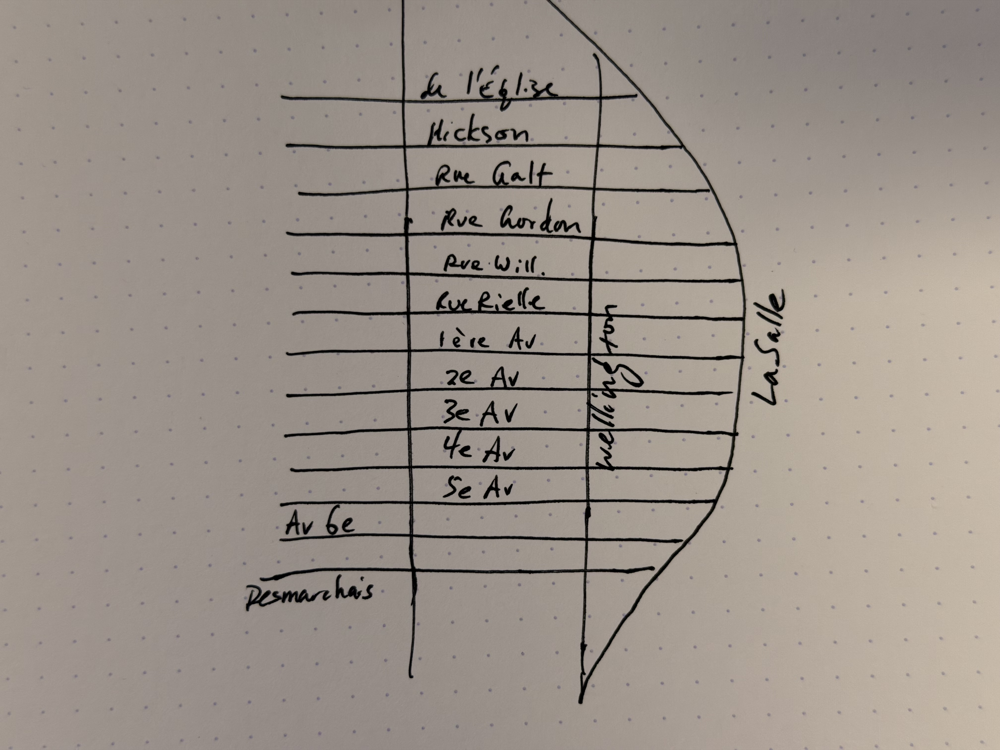

# Task: Hand-Drawn Map Corrections

**Category:** Image and Language Parsing

## Description

Ask the agent to identify critical mistakes in a hand-drawn street map.

## Prompt

> What are the critical mistakes in this map?

**Input image:** 

## Results

| Agent | Score | Notes |
|---|---|---|
| | | |

## Evaluation Criteria

- **Mistake identification**: Can the agent identify the two critical mistakes in the map?
- **Accuracy**: Are the identified mistakes actually errors (not false positives)?
- **Explanation**: Does the agent clearly explain what is wrong and why it's problematic?
- **Completeness**: Does the agent find both critical mistakes?
- **Map reading**: Can the agent correctly read the street names and understand the grid structure?
