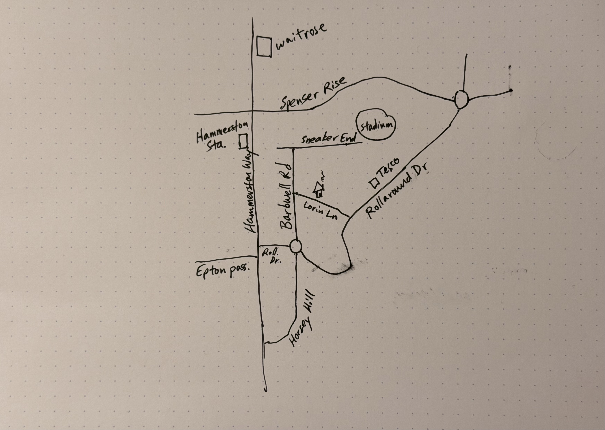

# Task: Hand-Drawn Map Navigation

**Category:** Image and Language Parsing

## Description

Ask the agent to interpret a hand-drawn map and determine the shortest route between two locations.

## Prompt

> Blake gave me a map to his house. Can you tell me the likely shortest route to his house from the station?

**Input image:** 

## Results

| Agent | Score | Notes |
|---|---|---|
| | | |

## Evaluation Criteria

- **Map interpretation**: Can the agent correctly read and identify the street names and landmarks on the hand-drawn map?
- **Route identification**: Does the agent identify Blake's house location correctly based on map context?
- **Route calculation**: Does the agent provide a logical shortest route from the station?
- **Clarity**: Is the route described clearly with specific street names and directions?
- **Reasoning**: Does the agent explain why the suggested route is the shortest?
