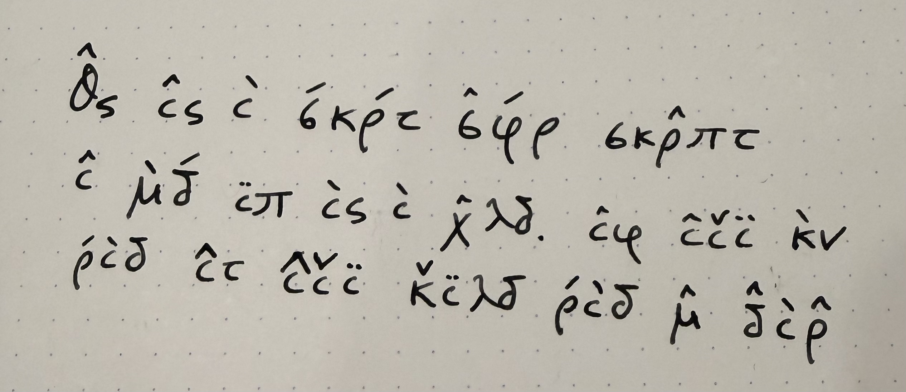

# Task: Simple Cipher

**Category:** Image and Language Parsing

## Description

Ask the agent to decode a message written in a cipher.

## Prompt

> What does this say?

**Input image:** 

## Results

| Agent | Score | Notes |
|---|---|---|
| | | |

## Evaluation Criteria

- **Cipher recognition**: Does the agent identify the type of cipher or encoding used?
- **Decoding accuracy**: Can the agent successfully decode the message?
- **Explanation**: Does the agent explain the decoding method used?
- **Completeness**: Is the entire message decoded correctly?
- **Reasoning**: Does the agent show its work or reasoning process?
