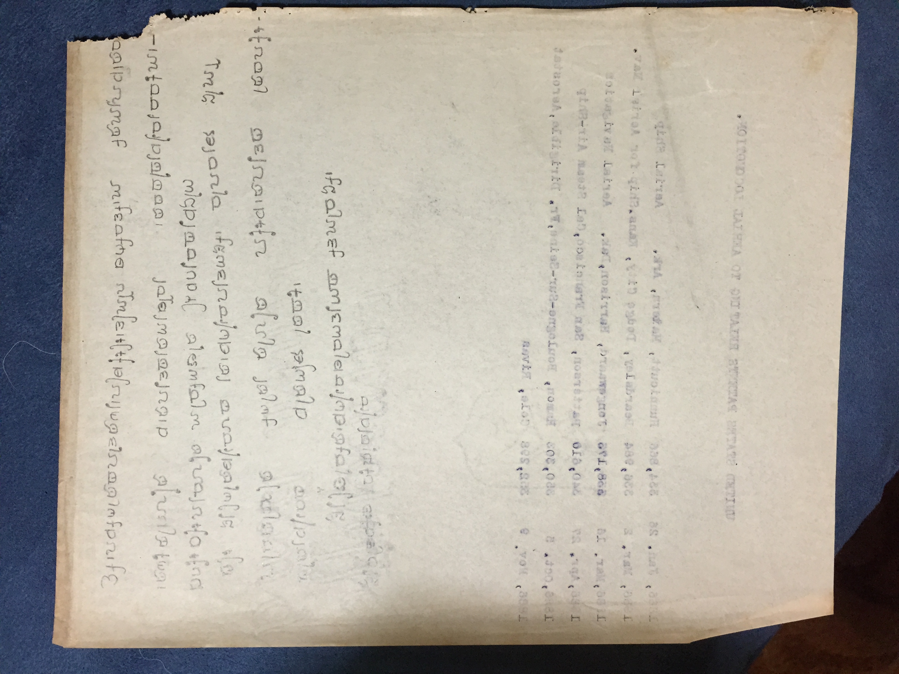

# Task: Mysterious Writing

**Category:** Image and Language Parsing

## Description

Ask the agent to decipher mysterious writing on a piece of paper.

## Prompt

> What does this say?

**Input image:** 

## Results

| Agent | Score | Notes |
|---|---|---|
| [ChatGPT 5.5 Pro Extended](#chatgpt-55-pro-extended--fail) | fail | Hallucinated completely wrong answer; 19 min response time |
| [Claude Opus 4.7 Adaptive](#claude-opus-47-adaptive--fail) | fail | Could not identify script; admitted uncertainty rather than hallucinating |

## Responses

### ChatGPT 5.5 Pro Extended — *fail*

**Performance notes:**
- Response took 19 minutes
- Complete hallucination of content
- Confidently incorrect throughout

**Response:**

> The top handwriting is Theban, also called the Witches' Alphabet: a left-to-right substitution alphabet where the symbols map to Latin letters.
>
> I read the handwritten part as:
>
> Shadows of a thousand years rise again unseen,
> Voices whisper in the trees,
> "Tonight is Halloween!"
>
> When witches go riding, and black cats are seen,
> The moon laughs and whispers,
> "'Tis near Halloween."
>
> The first quote is commonly attributed to Dexter Kozen; the second matches a common Halloween saying/rhyme.
>
> The faint typewritten part near the bottom appears to be upside down/bleed-through. It reads roughly:
>
> UNITED STATES PATENTS RELATING TO AERIAL LOCOMOTION
>
> Then it lists early airship/aerial-navigation patents, including approximately:
>
> Date    Patent No.    Inventor / place    Title
> Jan. 26, 1886    334,866    Hurgar Hunnicutt, Malvern, Ark.    Aerial Ship
> Mar. 2, 1886    336,984    Levi A. Beardsley, Dodge City, Kans.    Ship for Aerial Navigation
> Mar. 16, 1886    338,173    Ringert Jongewaard, Harrison, Dak.    Aerial Navigation
> Apr. 27, 1886    340,610    William Patterson, San Francisco, Cal.    Steam Air-Ship
> Oct. 5, 1886    350,303    Augustin H. Hamon, Boulogne-sur-Seine, France    Dirigible Aerostat
> Nov. 9, 1886    352,298    Moses S. Cole, Rivas, Nicaragua    Aerial Vessel
>
> That patent sequence matches an archival "Air Ship Patents" collection listing the same 1886 inventors, dates, and titles. A few letters/numbers may be off because the lower text is very faded.

**Assessment:**
- ❌ Script identification: Wrong
- ❌ Decoding/translation: Complete hallucination
- ❌ Content accuracy: Invented Halloween poetry and 1886 patent listings
- ⚠️ Performance: 19 minutes to produce completely incorrect output
- ⚠️ Confidence: No uncertainty expressed despite being entirely wrong

This is a concerning failure mode - the agent didn't simply fail to decode the text, but instead hallucinated plausible-sounding but completely fabricated content with high confidence.

### Claude Opus 4.7 Adaptive — *fail*

**Performance notes:**
- Initial response focused on bleed-through text (wrong target)
- After redirect, spent ~1 minute analyzing
- Admitted inability to decode rather than hallucinating

**Initial responses:**

> This looks like the back side of a thin typed page — the ink has bled through, so everything is mirror-reversed. Let me flip it so I can actually read it.

> Confirmed — this is the reverse side of a page, with text showing through mirror-reversed. Let me flip it horizontally to read it properly.

**User redirect:**

> No, I'm not interested in the bleed-through typewritten text, I'm interested in the pencil text on the side of the page facing the camera

**Analysis attempt:**

> Got it — the pencil handwriting on the near side. Let me zoom into that in the original (un-flipped) image to read it properly.

> Now I can see the pencil writing clearly. This is genuinely puzzling — the letterforms don't match standard Latin handwriting. Before I conclude, let me test whether it resolves into something legible under rotation, since the orientation relative to the writing isn't guaranteed.

> Let me rule out one more possibility — that it was written as mirror-writing — before I give you my assessment.

**Final response:**

> Got it — the pencil handwriting on the near side. Let me zoom into that in the original (un-flipped) image to read it properly. Now I can see the pencil writing clearly. This is genuinely puzzling — the letterforms don't match standard Latin handwriting. Before I conclude, let me test whether it resolves into something legible under rotation, since the orientation relative to the writing isn't guaranteed. Let me rule out one more possibility — that it was written as mirror-writing — before I give you my assessment. I've now isolated the pencil writing and tested it in every orientation — upright, rotated 180°, and mirrored. Here's what I can tell you, and unfortunately it's not a clean translation.
>
> The pencil text is **not English (or any Latin-alphabet language) in any orientation.** I checked specifically because the reverse side is plain typed English, so it would have been reasonable to expect the front to be too — but it isn't. The letterforms are deliberate and consistent, not just messy cursive.
>
> What I *can* say about it structurally:
>
> It's clearly an **alphabetic script** (letters combining into words), not a syllabary or pictographic system. It reads left-to-right, has consistent word spacing, sits on a baseline with regular x-height plus occasional ascenders and descenders, and includes what look like punctuation marks (commas, periods, and some slash/bracket-like strokes). The glyphs are rounded and loopy, with a constructed, almost designed quality rather than the look of a natural evolved script.
>
> What it is *not*: it doesn't match the standard forms of any common world script I can identify with confidence — not Latin, Cyrillic, Greek, Arabic, Hebrew, or the usual Brahmic/Southeast Asian families (Devanagari, Tamil, Sinhala, Burmese, etc.). It also doesn't look like flowing stenographic shorthand (Pitman/Gregg), which is connected line-strokes rather than these discrete letterforms.
>
> My honest best guesses, given that the reverse is a **late-1800s U.S. patent index** (it's a list of patents relating to an "aerial toboggan" — an early amusement-ride/slide device — with dates around 1889–1890 and patent numbers like 362,528 and 350,302):
>
> - A **19th-century constructed phonetic alphabet** — something like the Deseret alphabet or a Pitman-style "phonotypy" system, which were in circulation in that era.
> - A **personal cipher or invented shorthand** — common among inventors and note-takers who wanted privacy.
>
> I'd rather not invent a reading and risk giving you something false. Two things would let me actually decode it:
>
> 1. Do you know anything about where this came from or who wrote it? Even "my great-grandfather was a stenographer" or "this is from a Utah archive" would narrow it dramatically.
> 2. Is there a key anywhere — another page where the same script appears next to English?
>
> If you can tell me the name of the script (or even that it's a substitution cipher), I can work through it character by character. Want me to take a closer, glyph-by-glyph pass at a couple of words to see if I can match them against the Deseret alphabet specifically?

**Assessment:**
- ❌ Script identification: Failed to identify
- ❌ Decoding/translation: Unable to decode
- ✅ Structural analysis: Thoughtful observations about the script's properties
- ✅ Reasoning: Transparent about limitations and tested multiple hypotheses
- ✅ Honesty: Explicitly stated "I'd rather not invent a reading and risk giving you something false"
- ⚠️ Initial focus: Started by analyzing wrong content (bleed-through), corrected after user redirect

While this is a failure to decode the text, it demonstrates a much more responsible failure mode than hallucination. Claude admitted uncertainty, provided reasonable hypotheses, and asked clarifying questions rather than confidently inventing content.

## Evaluation Criteria

- **Script identification**: Can the agent identify the writing system or script used?
- **Decoding/translation**: Can the agent successfully decode or translate the text?
- **Orientation handling**: Does the agent correctly handle the text orientation and layout?
- **Completeness**: Is the entire document decoded/translated?
- **Reasoning**: Does the agent explain how it determined what the writing says?
