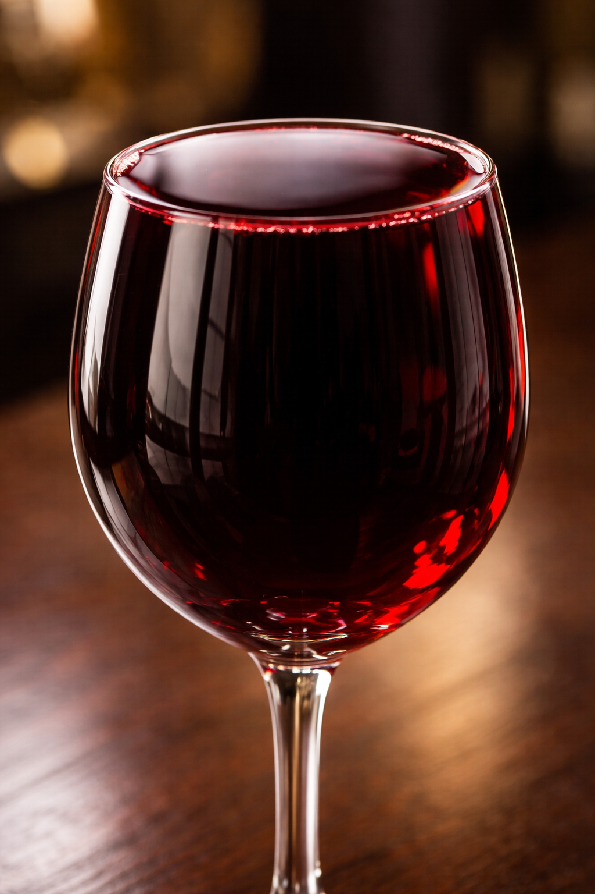
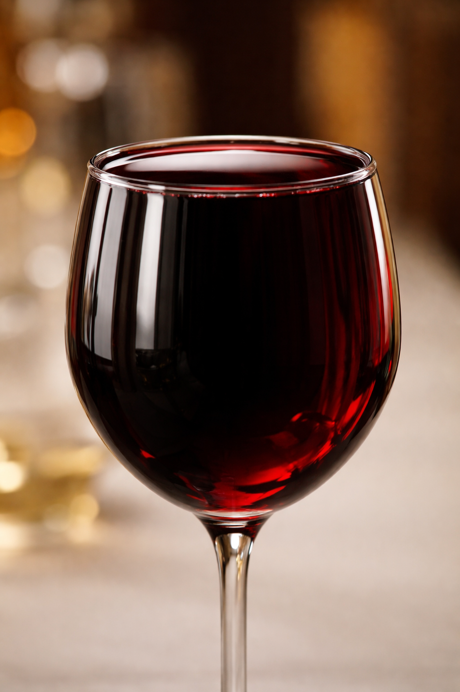

# Task: Wine Glass Full to the Brim

**Category:** Image Generation

## Description

Ask the agent to generate an image of a wine glass that is full to the brim of red wine.

## Prompt

> Please generate an image of a wine glass that is full to the brim of red wine, with a meniscus extending above the rim of the wine glass.

## Results

| Agent | Score | Notes |
|---|---|---|
| ChatGPT (GPT 5.3 Instant) | fail, almost passes | Fuller than typical model output; wine is just shy of the brim (close enough most humans would call it full), but no meniscus above the rim |
| ChatGPT (GPT 5.2 Thinking) | fail, almost passes | Same assessment as 5.3 Instant — would pass if not for the missing meniscus |
| Gemini 3.1 Pro (Thinking: Standard) | fail | Glass only 2/3 full with disturbing bulge in wine surface |

## Responses

### ChatGPT (GPT 5.3 Instant) — *fail, almost passes*

Fuller than any prior model output observed. Wine level is just shy of the brim — close enough that most humans would call it full — but there is no meniscus extending above the rim as requested.

### ChatGPT (GPT 5.2 Thinking) — *fail, almost passes*

Same assessment as 5.3 Instant. Would be a pass if not for the missing meniscus.

### Gemini 3.1 Pro (Thinking: Standard) — *fail*

Glass is only approximately 2/3 full, well below the brim. Additionally, the wine surface has an unnatural bulge/curve that doesn't match realistic liquid physics. Significantly worse than the ChatGPT results which at least get close to the brim.

## Evaluation Criteria

- **Accuracy**: Does the image depict a wine glass (correct shape, stem, bowl)?
- **Full to the brim**: Is the wine filled exactly to the rim without overflowing?
- **Color**: Is the wine visibly red?
- **Quality**: Is the image photorealistic or otherwise high quality?
- **Atmosphere**: Is the lighting and composition visually appealing?
