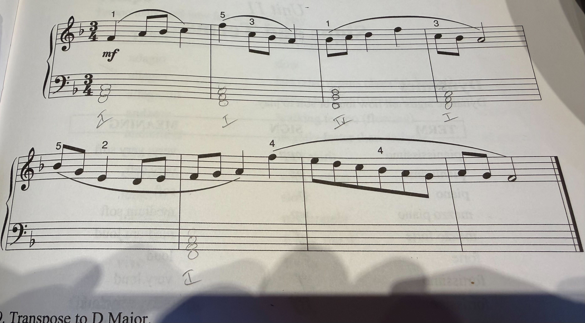

# Task: Music Theory Homework

**Category:** Sheet Music

## Description

The agent is shown an image of music theory homework and asked to evaluate it and demonstrate the correct approach.

## Prompt

> Does what I've done look right here and how would you do it?

**Input image:** 

## Results

*Tests run: 2026-03-05*

| Agent | Score | Notes |
|---|---|---|
| ChatGPT - Auto | fail | Impressive image parsing, but makes key transcription mistakes and mistakes on the actual answer |

## Responses

### ChatGPT - Auto — *fail*

*Response text to be added.*

## Evaluation Criteria

- **Accuracy**: Does the agent correctly identify errors or confirm correct work?
- **Explanation**: Does it explain the music theory concepts clearly?
- **Demonstration**: Does it show how to do it correctly?
