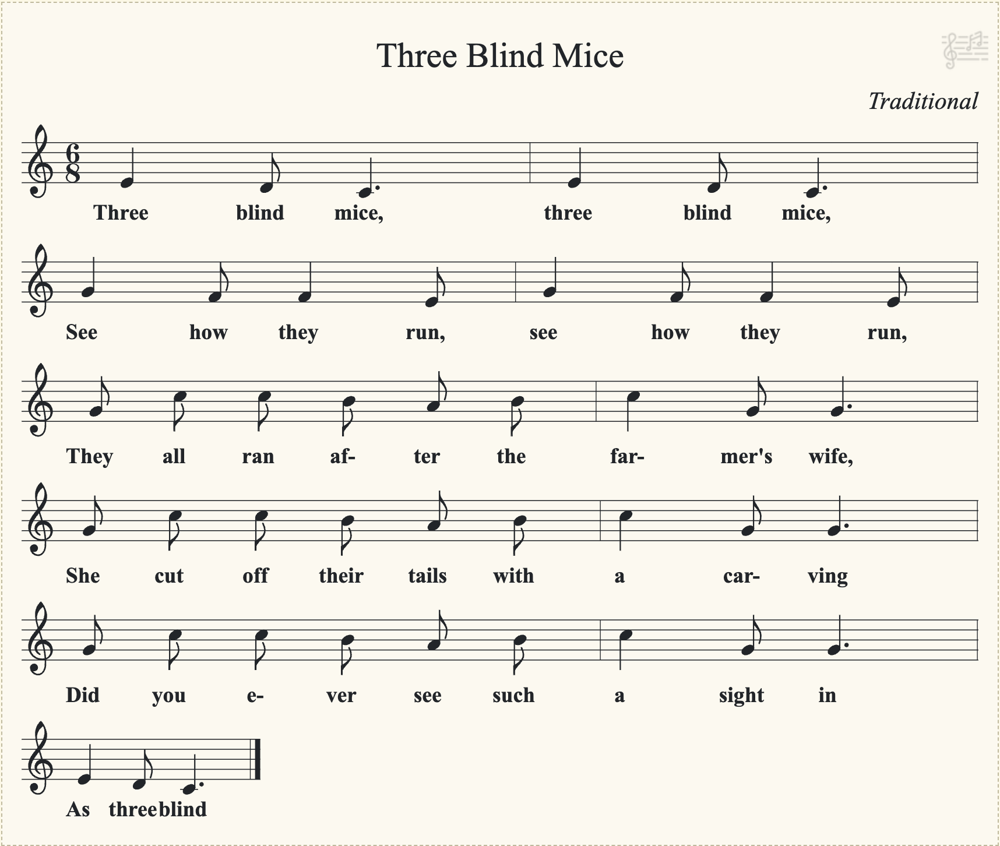

# Task: Three Blind Mice

**Category:** Sheet Music

## Description

Ask the agent to produce sheet music for the traditional nursery rhyme "Three Blind Mice."

## Prompt

> Write out the sheet music for "Three Blind Mice."

## Results

| Agent | Score | Notes |
|---|---|---|
| Gemini 3.1 Pro (Thinking: Standard) | fail | Pitches mostly correct, but rhythm completely wrong |

## Responses

### Gemini 3.1 Pro (Thinking: Standard) — *fail*

Gemini stated it cannot generate sheet music directly but provided ABC notation. When the ABC notation was converted using standard tools (abcnotation.com, notabc.app), the result had the following issues:

**Analysis:**
- **Pitches**: Generally correct - E-D-C for "Three blind mice", G-F-F-E for "See how they run", etc.
- **Rhythm**: Completely wrong - the note values are inconsistent and don't match the traditional melody
- **Time signature**: Correctly specified as 6/8
- **Format**: Valid ABC notation that converts to standard notation

The traditional "Three Blind Mice" has a distinctive rhythmic pattern (quarter-eighth in 6/8 time), but the generated rhythm is essentially random.

**Important note:** Even if the rhythm had been correct, this would still be a fail. The task is to assess the agent's ability to generate sheet music. Gemini stated it cannot generate sheet music and instead provided ABC notation that requires external conversion. This doesn't demonstrate the agent's sheet music generation capability—it only shows it can output text in a music notation format. That said, it's interesting that the rhythm was completely wrong, suggesting limitations even in the ABC notation generation itself.

## Evaluation Criteria

- **Correctness**: Are the notes and rhythm accurate to the traditional melody?
- **Completeness**: Does it include all three phrases of the song?
- **Format**: Is the notation legible and in a standard format (e.g., ABC notation, LilyPond, MusicXML, or rendered image)?
- **Key and time signature**: Is the key and time signature (typically 6/8 or 3/4) correctly specified?
