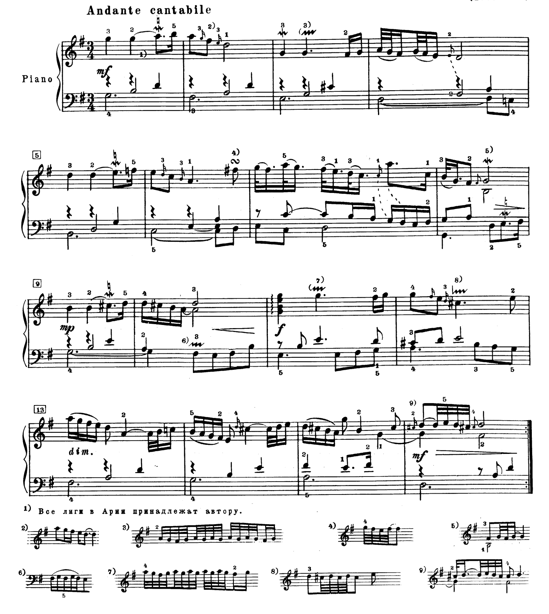

# Task: String Trio Transcription

**Category:** Sheet Music

## Description

Ask the agent to transcribe a piano piece for string trio (violin, viola, cello) and produce both a score and individual parts.

## Prompt

> Please transcribe the music in this image for cello, viola, and violin, and produce the score and parts.

**Input image:** 

## Results

| Agent | Score | Notes |
|---|---|---|
| | | |

## Evaluation Criteria

- **Arrangement quality**: Is the piano music appropriately distributed across the three string instruments?
- **Range appropriateness**: Are notes within the comfortable playing range of each instrument (violin: G3-A7, viola: C3-E6, cello: C2-A5)?
- **Musical coherence**: Does the arrangement preserve the musical character and harmony of the original?
- **Voice leading**: Are there smooth transitions and logical voice assignments?
- **Completeness**: Are both a full score and individual parts provided?
- **Clef accuracy**: Violin in treble clef, viola in alto clef, cello in bass clef (with tenor clef for higher passages if needed)?
- **Format**: Is the output in a usable format (rendered notation, LilyPond, MusicXML, ABC notation, or similar)?
- **Playability**: Are the parts practically playable by human musicians (no excessive position changes, awkward string crossings, etc.)?
